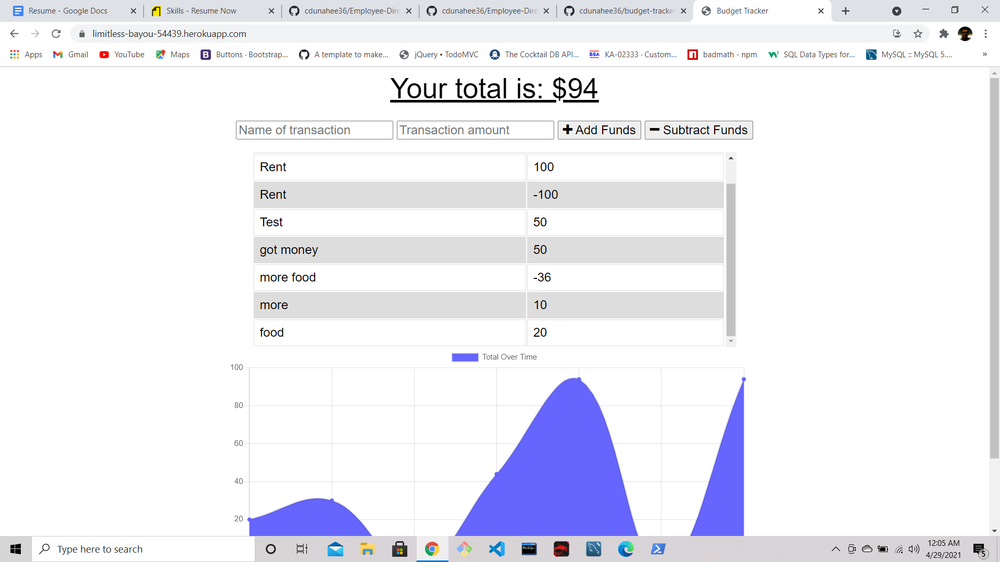
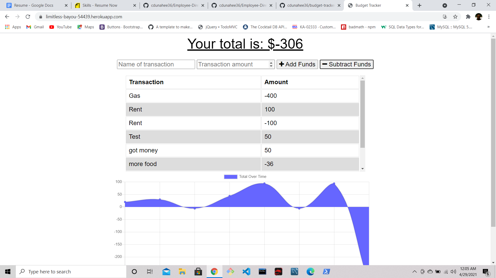

# budget-tracker

## Description 

* The budget tracker allows the user to keep track of all their funds.
They can give each and every transaction a title and subtract it or add
to the grand total. It also shows them a chart that shows the fluctuation
of all their transactions.

## Real World Application

* This app would be ideal for somebody who doesn't have an online bank account.
They could just put all their daily spending onto this application and come back to
it if they ever need to remember what they purchased.

## License

* MIT

# Screenshots

